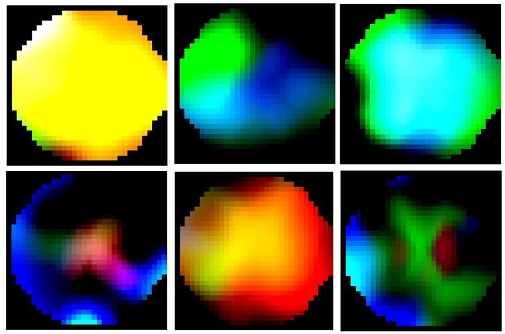

Data generate codes for "A gradient-based automatic optimization CNN framework for EEG state recognition". 

## Citation
```
@article{wang2022gradient,
title={A gradient-based automatic optimization CNN framework for EEG state recognition},
author={Wang, He and Zhu, Xinshan and Chen, Peiyin and Yang, Yuxuan and Ma, Chao and Gao, Zhongke},
journal={Journal of Neural Engineering},
volume={19},
number={1},
pages={016009},
year={2022},
publisher={IOP Publishing}
}
```


## Prepare Datasets
We used two public datasets in this study:
- [Seed Dataset](https://bcmi.sjtu.edu.cn/~seed/index.html)
- [Fatigue Driving Dataset](https://figshare.com/articles/dataset/Multi-channel_EEG_recordings_during_a_sustained-attention_driving_task/6427334)


## Results
The fatigued driving dataset is labelled according to the labelling methods for datasets in literature "Toward Drowsiness Detection Using Non-hair-Bearing EEG-Based Brain-Computer Interfaces"[1]. After the labelling is completed, the frequency domain features of the EEG signal are extracted using EEGLab and mapped to a 2D image based on the Azimuthal Equidistant Projection method with Clough-Tocher interpolation [2].
The generated image is shown below:


```
@articleE{1,
  author={Wei, Chun-Shu and Wang, Yu-Te and Lin, Chin-Teng and Jung, Tzyy-Ping},
  journal={IEEE Transactions on Neural Systems and Rehabilitation Engineering}, 
  title={Toward Drowsiness Detection Using Non-hair-Bearing EEG-Based Brain-Computer Interfaces}, 
  year={2018},
  volume={26},
  number={2},
  pages={400-406},
  publisher={IEEE}
}

@article{2,
  title={Learning representations from EEG with deep recurrent-convolutional neural networks},
  author={Bashivan, Pouya and Rish, Irina and Yeasin, Mohammed and Codella, Noel},
  journal={arXiv preprint arXiv:1511.06448},
  year={2015}
}
```
